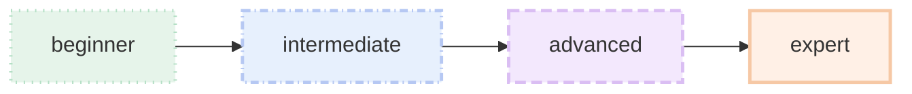

### Status shapes

```mermaid
graph LR
  A["published"]
  B[["draft"]]
  C>"wip"]
  D("planned")
  A --> B --> C --> D
  classDef pub fill:#e6f4ea,stroke:#b4dfc5,stroke-width:2.5px,stroke-dasharray:0
  classDef dft fill:#FAEEDA,stroke:#FAC775,stroke-width:2.5px,stroke-dasharray:1 4
  classDef wip fill:#fff0e6,stroke:#f6c8a5,stroke-width:2.5px,stroke-dasharray:5 4
  classDef pln fill:#f1f5f9,stroke:#cbd5e1,stroke-width:2.5px,stroke-dasharray:10 5
  class A pub
  class B dft
  class C wip
  class D pln
```

### Level borders (dots → dash-dot → long-dash → solid)

```mermaid
graph LR
  L1["beginner"]
  L2["intermediate"]
  L3["advanced"]
  L4["expert"]
  L1 --> L2 --> L3 --> L4
  classDef lv1 fill:#e6f4ea,stroke:#b4dfc5,stroke-width:2.5px,stroke-dasharray:1 5
  classDef lv2 fill:#e7f0fd,stroke:#b6c8f3,stroke-width:2.5px,stroke-dasharray:6 3 1 3
  classDef lv3 fill:#f3e8fd,stroke:#dabef3,stroke-width:2.5px,stroke-dasharray:8 4
  classDef lv4 fill:#fff0e6,stroke:#f6c8a5,stroke-width:2.5px,stroke-dasharray:0
  class L1 lv1
  class L2 lv2
  class L3 lv3
  class L4 lv4
```

### Combined — status shape + level border

```mermaid
graph LR
  X1["published beginner"]
  X2[["draft intermediate"]]
  X3>"wip advanced"]
  X4("planned expert")
  X1 --> X2 --> X3 --> X4
  classDef cx1 fill:#e6f4ea,stroke:#b4dfc5,stroke-width:2.5px,stroke-dasharray:1 5
  classDef cx2 fill:#FAEEDA,stroke:#b6c8f3,stroke-width:2.5px,stroke-dasharray:6 3 1 3
  classDef cx3 fill:#fff0e6,stroke:#dabef3,stroke-width:2.5px,stroke-dasharray:8 4
  classDef cx4 fill:#f1f5f9,stroke:#f6c8a5,stroke-width:2.5px,stroke-dasharray:0
  class X1 cx1
  class X2 cx2
  class X3 cx3
  class X4 cx4
```
